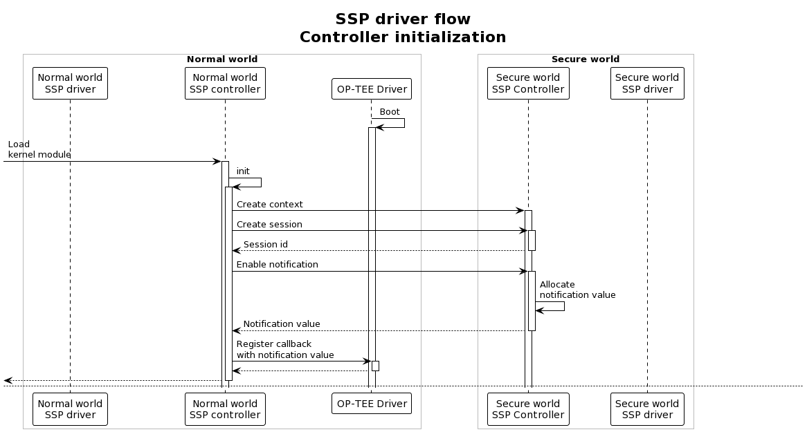
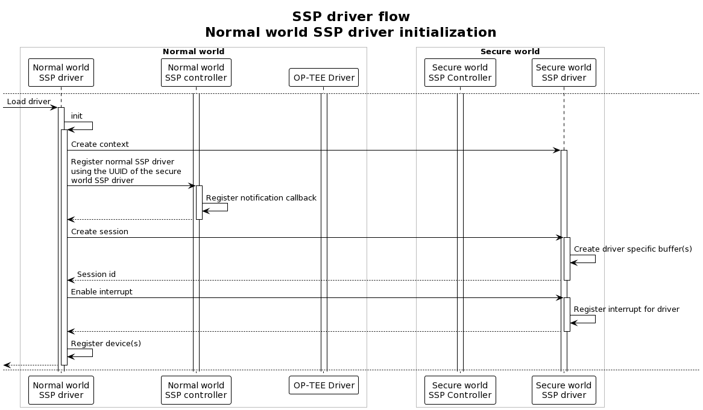
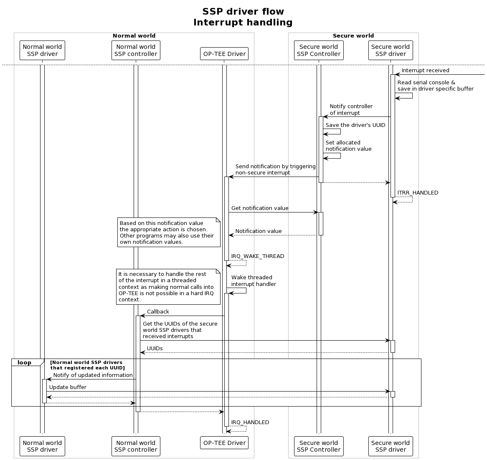

# Implementation into OP-TEE OS

## Build instructions

### QEMU

As shown in the figures in the previous sections, both loadable kernel modules and pseudo trusted applications are part of the architecture and thus they all need to be compiled. This requires multiple compile commands in different directories. These commands need to be executed in order:

1. Init repo with the right manifest in the project root directory:

    ``` sh
    mkdir -p <project-dir>
    cd <project-dir>
    repo init -u https://github.com/Distrinet-TACOS/manifest.git -m tacos-qemu-driver.xml
    repo sync -j4 --no-clone-bundle
    ```

2. In `<project-dir>/build/`:

    ``` sh
    make CFG_CORE_ASLR=n GDBSERVER=y -j`nproc`
    ```

3. In `<project-dir>/optee_client/`:

    ``` sh
    make
    ```

4. In `<project-dir>/optee_os/`:

    ``` sh
    make \
        CFG_TEE_BENCHMARK=n \
        CFG_TEE_CORE_LOG_LEVEL=3 \
        CROSS_COMPILE=arm-linux-gnueabihf- \
        CROSS_COMPILE_core=arm-linux-gnueabihf- \
        CROSS_COMPILE_ta_arm32=arm-linux-gnueabihf- \
        CROSS_COMPILE_ta_arm64=aarch64-linux-gnu- \
        DEBUG=1 \
        O=out/arm \
        PLATFORM=vexpress-qemu_virt
    ```

5. In `<project-dir>/optee_examples/`:

    ``` sh
    make \
        --no-builtin-variables \
        TA_DEV_KIT_DIR=<project-dir>/optee_os/out/arm/export-ta_arm32/ \
        CROSS_COMPILE=arm-linux-gnueabihf- \
        TEEC_EXPORT=<project-dir>/optee_client/out/export/usr \
        PLATFORM=vexpress-qemu_virt \
        HOST_CROSS_COMPILE=<project-dir>/toolchains/aarch32/bin/arm-linux-gnueabihf-
    ```

    It might be necessary to first go into specific directories in `<project-dir>/optee_examples/` because of module dependencies. The parent modules should thus be build first using the same command.

6. Finally, in `<project-dir>/build/`:

    ``` sh
    make run CFG_CORE_ASLR=n GDBSERVER=y -j`nproc`
    ```

### SABRE Lite

As explained in @sec-build-sabrelite, the *Buildroot* build system is used to build the complete package for the Sabre Lite board. For this process, the same steps are followed as explained in that section. However, an extra external Buildroot tree is added which contains the kernel modules for the normal world, while the secure world components are contained on a custom branch of our OP-TEE OS fork. It is thus easiest to start with an empty workspace.

1. Start by cloning the necessary repositories:

   ``` sh
    mkdir -p <project-dir>
    cd <project-dir>
    git clone https://github.com/Distrinet-TACOS/buildroot.git
    git clone https://github.com/Distrinet-TACOS/buildroot-external-boundary.git
    git clone https://github.com/Distrinet-TACOS/shared-secure-peripherals.git
   ```

2. Now generate the output folder using the following command:

    ``` sh
    make BR2_EXTERNAL=$PWD/buildroot-external-boundary/:$PWD/shared-secure-peripherals/ -C buildroot/ O=$PWD/output imx6q_sabrelite_defconfig
    ```

3. The build and flash steps are the same as in @sec-build-sabrelite.
4. To actually test the functionality, after booting and logging in, enter the following on the normal world console:

   ``` sh
    modprobe normal-controller
    modprobe normal-ssp-driver
   ```

   This loads the normal world controller and driver into the Linux kernel.

5. It is now possible to interact with the secure world serial console. Everything that you type in that console gets sent to the normal world driver, which acts as a character device. To display its buffer, execute:

   ``` sh
   cat /dev/normal-ssp-driver
   ```

## Technical details

During the implementation of these shared secure peripherals on the SABRE Lite board we encountered some interesting difficulties:

- The UART driver present for iMX.6 boards did not enable serial interrupts at boot. We added the necessary logic so that it does. The initialization of the UART subsystem is carried over from U-Boot after which the necessary bits are set.
- The device tree for the iMX.6 SABRE Lite boards did not contain an interrupt parent for the optee firmware node. The fix was to introduce the parent `intc: interrupt-controller@a01000` at the main node of the tree.
- While trying to handle the notification from the secure world in the hard IRQ context of the asynchronous notification, we had difficulties with doing a normal call into the secure world. After investigating this it became clear that this was not supported behavior. The call into the secure world is thus made in a threaded IRQ context.

The actual and detailed control flow of our implementation can be seen in the following figures:




