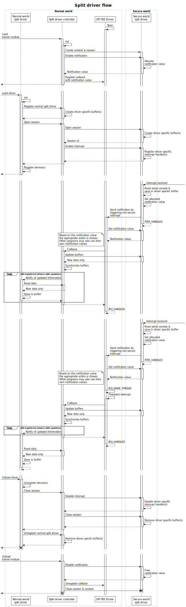
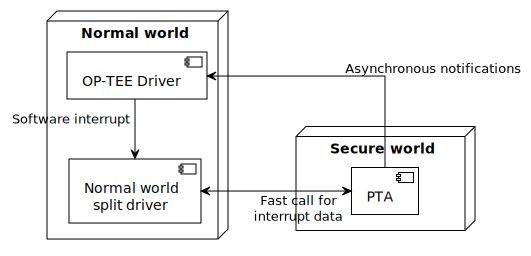

# Split driver for OP-TEE

Currently, for *Trusted Execution Environments* (TEE), there exist drivers that can operate as regular devices (think of character devices in Linux operating systems) and enable interaction between user space applications in the normal world and the TEE subsystem in a transparent fashion. This takes all the technicalities out of the communication with these TEE subsystems. This is useful in the case of writing an adapter between existing applications that are already interacting with interfaces of regular devices and the TEE subsystem, such that the applications do not need to be rewritten.

A split driver for OP-TEE is a driver that consists of two parts: a normal world device with a normal world driver and a secure world driver. These two drivers work together to form a device that is able to react to interrupts in the secure world. It is clear that having such a driver makes it possible for any normal world, user space applications to function normally, without needing refactoring, and interoperate with code running in the secure world. Say a program normally interacts with a serial interface; the handling of the serial interface can be delegated to the secure world and a split driver would act as the serial interface.

<!-- Callback on interrupt -->

!include`incrementSection=1` callback/main.md

## Split driver using callbacks

Given the new feature described in the previous section, it is possible to construct a split driver over both the normal and the secure world. The added component compared to the previous section is the *Normal world split driver* (NWSD), which is responsible for the registration of a device in the linux os and the interaction with that device.

Like previously described, when an interrupt is received in the PTA (now called the *Secure world split driver* (SWSD)), it sends an asynchronous notification to the OP-TEE driver. This driver notices that the notification comes from the secure world split driver because of the notification value. Different from the previous section, the NWSD is called from the OP-TEE driver using software interrupts. It thus needs to register an interrupt handler for this at initialization time. While registering this interrupt, it notifies the SWSD of its presence by invoking a function in the SWSD. This registers the hardware interrupt and allocates a notification value, which is then passed on to the OP-TEE driver.

After the software interrupt is triggered, the NWSD catches it. This allows it to make a fast call into the SWSD to get the serial character for which the hardware interrupt was thrown in the first place. This character is then stored in a buffer.

While this interrupt handling happens, the hardware interrupts are disabled to prevent lost characters. This ca be fixed by implementing a buffer in the SWSD and defining a protocol through which the NWSD gets all characters. Multiple hardware interrupts, thrown in the time it takes to handle one, should however not result in multiple interrupt handling cycles.

