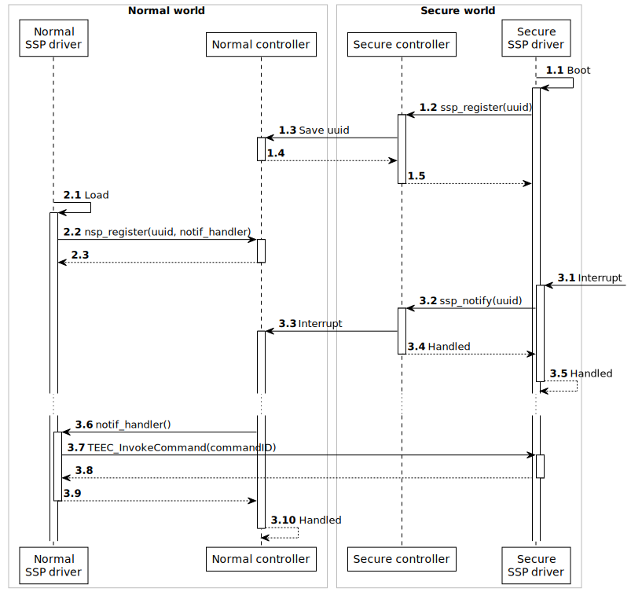

# Shared Secure Peripherals for OP-TEE

Currently, for *Trusted Execution Environments* (TEE), there exist no drivers that can operate as regular devices (think of character devices in Linux operating systems) and enable interaction between user space applications in the normal world and the TEE subsystem in a transparent fashion. This takes all the technicalities out of the communication with these TEE subsystems. This is useful in the case of writing an adapter between existing applications that are already interacting with interfaces of regular devices and the TEE subsystem, such that the applications do not need to be rewritten.

A Shared Secure Peripheral (SSP) driver for OP-TEE is a driver that consists of two parts: a normal world device with a normal world driver and a secure world driver. These two drivers work together to form a device that is able to react to interrupts in the secure world. It is clear that having such a driver makes it possible for any normal world, user space applications to function normally, without needing refactoring, and interoperate with code running in the secure world. Say a program normally interacts with a serial interface; the handling of the serial interface can be delegated to the secure world and a split driver would act as the serial interface.

<!-- Callback on interrupt -->

!include`incrementSection=1` callback.md

## SSP driver using callbacks

Given the new feature described in the previous section, it is possible to construct a driver that crosses over the normal and the secure world barrier. We created a pair of drivers, a *normal world SSP driver* and a *secure world SSP driver*, that are responsible for providing access to SSPs. The secure SSP driver directly interacts with the SSP hardware, while the normal SSP driver needs to go through the secure driver for their interaction with that hardware. The following figure shows the overview of the architecture of the drivers and the system supporting and provided by its functionality.

This figure also shows that communication from the normal to the secure world is delivered by an existing API (the GlobalPlatform TEE Client API^[https://globalplatform.org/specs-library/tee-client-api-specification/]). This API provides access to TAs running in the secure world based on their identifying UUID, and secured by access control. The normal SSP driver may thus call arbitrary functionality, implemented by the developer of a specific application, of the secure SSP driver. The secure SSP driver may thus also implement some kind of mixer logic if required.

::: tip
*Mixer Logic*

Consider a display as a SSP. This display normally shows output of a normal world application, but overlays some output of a secure application (e.g. warnings etc.). In this case the secure SSP driver needs to combine both output buffers in a way that the secure output is always shown on top of the normal output. The logic required for this operation is called mixer logic.
:::

To allow other applications, both on the normal and the secure side, to interact with the hardware as well, both drivers should provide facilities that expose the necessary functionality. In the secure world, the communication with the secure driver happens through the GlobalPlatform Internal Core API^[https://globalplatform.org/specs-library/tee-internal-core-api-specification/], version 1.1. Mission-critical control software like PLC controllers etc. can thus be separated from the hardware driver and moved to user space.

When the secure world SSP Driver wants to notify the normal world of some event, it cannot use existing APIs, as these only provide a one way communication from the normal to the secure world. This is why we provide a simple and concise package that implements just this functionality. These can be seen in the previous figure as the *controller* elements. Both the normal and the secure controller provide an API to register drivers to the notification system, `nsp_register(uuid, notif_handler)` and `ssp_register(uuid)` respectively. This methods accept an UUID, which is used to uniquely identify each secure application, and `nsp_register` additionally accepts a handler for incoming notifications. After registering both normal and secure world drivers, the secure SSP driver can notify the normal SSP driver using by calling `ssp_notify(uuid)`. This will internally trigger a hardware interrupt that will be caught by the normal controller, which in turn calls the notification handler of the normal SSP driver. This flow through the system can be seen in the following figure.

