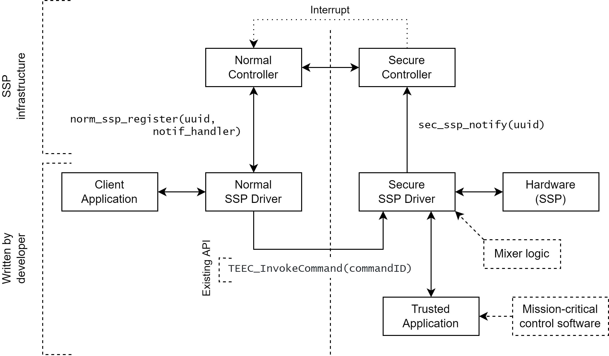
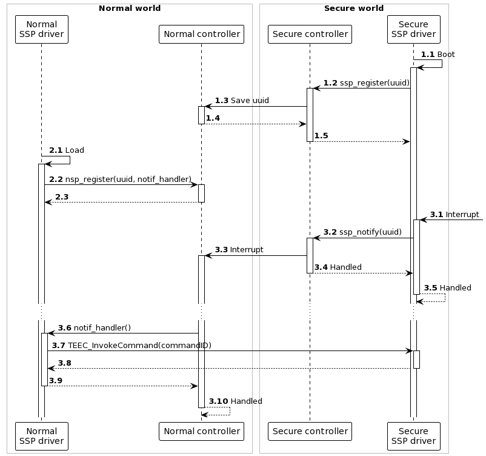

# Shared Secure Peripherals for OP-TEE

Currently, for *Trusted Execution Environments* (TEE), there exist no drivers that can operate as regular devices (think of character devices in Linux operating systems) and enable interaction between user space applications in the normal world and the TEE subsystem in a transparent fashion. This takes all the technicalities out of the communication with these TEE subsystems. This is useful in the case of writing an adapter between existing applications that are already interacting with interfaces of regular devices and the TEE subsystem, such that the applications do not need to be rewritten.

A Shared Secure Peripheral (SSP) driver for OP-TEE is a driver that consists of two parts: a normal world device with a normal world driver and a secure world driver. These two drivers work together to form a device that is able to react to interrupts in the secure world. It is clear that having such a driver makes it possible for any normal world, user space applications to function normally, without needing refactoring, and interoperate with code running in the secure world. Say a program normally interacts with a serial interface; the handling of the serial interface can be delegated to the secure world and a driver split over both worlds would act as the serial interface.

## Normal world callback on secure world interrupt

Because of the design of TEEs, it is not possible to directly communicate with the normal world from the secure world. It is thus not immediately possible to react to a secure world interrupt in the normal world.

Say that a [secure interrupt][2] is registered on a serial interface of the secure world and that this interrupt event is of importance to the normal world and requires special handling there. The interrupt requires the secure world to handle this interrupt with an earlier defined interrupt handler. The Secure Monitor preempts the normal world and starts execution of this handler in the secure world. But how do we notify the normal world of this event?

The normal world is able to communicate with the secure world via well defined channels. This means that threads on the Linux based operating system can easily open communication channels to trusted applications in the secure world. This happens through the well known [GlobalPlatform Client API][1]. The normal world can launch calls into the secure world with some kind of argument passing or shared memory, as described in the Client API. In this way, the secure world is able to populate those memory locations with data of use to the normal world.

It is thus possible to approximate communication from the secure world to the normal world by globally saving data or state of the interrupt handler and its results, which can be polled by the normal world. This is however an inefficient solution, as the normal world needs to do constant polling to the secure world, and defeats the purpose of interrupts.

The solution to this problem is a newly developed mechanism, aptly called [*Asynchronous Notifications*][3]. This is a feature that is added to the Linux kernel, but it is still in the middle of the review process. This feature is thus not yet generally available. To check out this feature, you can clone the `tacos-qemu-callback.xml` manifest file as explained earlier in the [Download of repositories](#download-of-repositories) section. This section will cover the implementation details of this feature.

[1]: https://globalplatform.org/specs-library/tee-client-api-specification/
[2]: https://optee.readthedocs.io/en/latest/architecture/core.html#native-and-foreign-interrupts
[3]: https://optee.readthedocs.io/en/latest/architecture/core.html#notifications

### Feature state

This notification feature is explained in the OP-TEE documentation in the section about [asynchronous notifications](https://optee.readthedocs.io/en/latest/architecture/core.html#notifications). It consists of two active RFCs, one on the [optee_os](https://github.com/OP-TEE/optee_os) repository and on the [linaro-swg linux](https://github.com/linaro-swg/linux) repository. Because the changes to the linux repository are actually changes to the Linux kernel itself, these changes need to be upstreamed to the actual Linux kernel. Although this feature is generally well received by the kernel maintainers, this review process is lengthy, with multiple back and forths between the Linaro developers and the maintainers. It generally takes a few months until the changes are accepted. The changes to optee_os are on hold until the upstreaming process is finished.

### Using asynchronous notifications

Luckily, the mechanism that is currently being reviewed is in a working state, which means we can pull it in our working copy and use it to our hearts content. The changes have already been applied to our fork of the linux kernel, and can be pulled from git as explained in the introduction of this section.

#### Secure world to normal world

The notification to the normal world is achieved through triggering a non-secure interrupt. The triggering of this interrupt is platform specific and done via `itr_raise_pi()`. This call is wrapped in a function called `notif_send_async`, which can be called in an interrupt handler in the secure world. An example implementation can be found in `optee_os/core/arch/arm/plat-vexpress/main.c`. When this non-secure interrupt has been triggered, the Linux kernel in the normal world launches the normal interrupt handling process. At system startup, a handler for this kind of notification interrupt has been registered, so that handler is used.

The *hard* interrupt handler `notif_irq_handler`^[`/drivers/tee/optee/notif.c`] of a threaded interrupt with the name `optee_notification` is registered during the initialization of the kernel. This handler is responsible for deciding what to do with the interrupt thrown, based on the value of the notification. This value is collected by the function called `get_async_notif_value`. The only value that is currently implemented is `OPTEE_SMC_ASYNC_NOTIF_VALUE_DO_BOTTOM_HALF`, but the implementation could easily be extended to allow for different notifications.

Because the interrupt handler in the Linux kernel is a *threaded interrupt* it is also possible to do further handling in the interrupt handler thread called `notif_irq_thread_fn`. This is the appropriate way to execute more complex interrupt handling that could block the kernel for quite some time.

#### Normal world to secure world

On the secure side, a *notification driver* can be registered, should you want to use the asynchronous notification feature as intended. An example implementation can be found in the file `optee_os/core/arch/arm/plat-vexpress/main.c`. However, to write some kind of driver split over the two worlds, we are not fully using this feature, but just using half of the communication channel: from the secure to the normal world.

### Practical overview

The following figure shows the sequence of events defined by the asynchronous notifications feature. The OP-TEE driver is the default driver that manages the TEE and thus OP-TEE OS. This driver always registers an interrupt handler for the asynchronous notifications interrupt line on start up. The PTA also registers an interrupt handler, this time for the external hardware interrupt line.

When this hardware interrupt is caught by the PTA, the PTA saves the notification value ^[This value is manually programmed, based on the interrupt the handler will be handling.] and sends an asynchronous notification to the OP-TEE driver by triggering a non-secure software interrupt. This allows the PTA to finish execution before the OP-TEE driver handles the interrupt.

When the OP-TEE driver interrupt handler starts handling the software interrupt, it asks for the notification value using a fast call to the OP-TEE OS. Based on this value the driver may choose to do a multitude of things. In the current implementation state, the only value that is implemented is, as explained before, `OPTEE_SMC_ASYNC_NOTIF_VALUE_DO_BOTTOM_HALF`, which launches a yielding call into the secure os. This yielding call is possible because the interrupt handler in the driver is a [threaded interrupt handler](https://www.kernel.org/doc/htmldocs/kernel-api/API-request-threaded-irq.html). This threaded interrupt handler is implemented in such a way that the notification value is requested in the *hard interrupt context*, but the bottom half yielding call is made in the threaded interrupt context. This yielding call can thus be preempted, functionality that is not inherently present in the OP-TEE OS.

![Sequence diagram showing how asynchronous notifications work.]    (figures/async-notif.png)

## SSP driver using callbacks

Given the new feature described in the previous section, it is possible to construct a driver that crosses over the normal and the secure world barrier. We created a pair of drivers, a *normal world SSP driver* and a *secure world SSP driver*, that are responsible for providing access to SSPs. The secure SSP driver directly interacts with the SSP hardware, while the normal SSP driver needs to go through the secure driver for their interaction with that hardware. The following figure shows the overview of the architecture of the drivers and the system supporting and provided by its functionality.

This figure also shows that communication from the normal to the secure world is delivered by an existing API (the GlobalPlatform TEE Client API^[https://globalplatform.org/specs-library/tee-client-api-specification/]). This API provides access to TAs running in the secure world based on their identifying UUID, and secured by access control. The normal SSP driver may thus call arbitrary functionality, implemented by the developer of a specific application, of the secure SSP driver. The secure SSP driver may thus also implement some kind of mixer logic if required.

:::{.callout-note}
*Mixer Logic*

Consider a display as a SSP. This display normally shows output of a normal world application, but overlays some output of a secure application (e.g. warnings etc.). In this case the secure SSP driver needs to combine both output buffers in a way that the secure output is always shown on top of the normal output. The logic required for this operation is called mixer logic.
:::

To allow other applications, both on the normal and the secure side, to interact with the hardware as well, both drivers should provide facilities that expose the necessary functionality. In the secure world, the communication with the secure driver happens through the GlobalPlatform Internal Core API^[https://globalplatform.org/specs-library/tee-internal-core-api-specification/], version 1.1. Mission-critical control software like PLC controllers etc. can thus be separated from the hardware driver and moved to user space.

When the secure world SSP Driver wants to notify the normal world of some event, it cannot use existing APIs, as these only provide a one way communication from the normal to the secure world. This is why we provide a simple and concise package that implements just this functionality. These can be seen in the previous figure as the *controller* elements. Both the normal and the secure controller provide an API to register drivers to the notification system, `norm_ssp_register(uuid, notif_handler)` and `ssp_register(uuid)` respectively. This methods accept an UUID, which is used to uniquely identify each secure application, and `norm_ssp_register` additionally accepts a handler for incoming notifications. After registering both normal and secure world drivers, the secure SSP driver can notify the normal SSP driver using by calling `ssp_notify(uuid)`. This will internally trigger a hardware interrupt that will be caught by the normal controller, which in turn calls the notification handler of the normal SSP driver. This flow through the system can be seen in the following figure.

